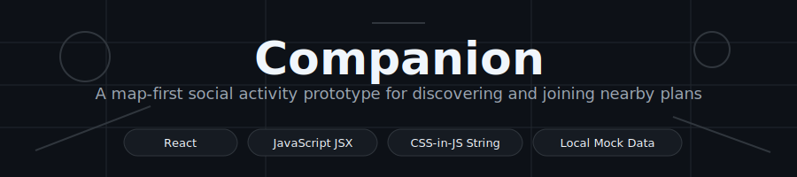
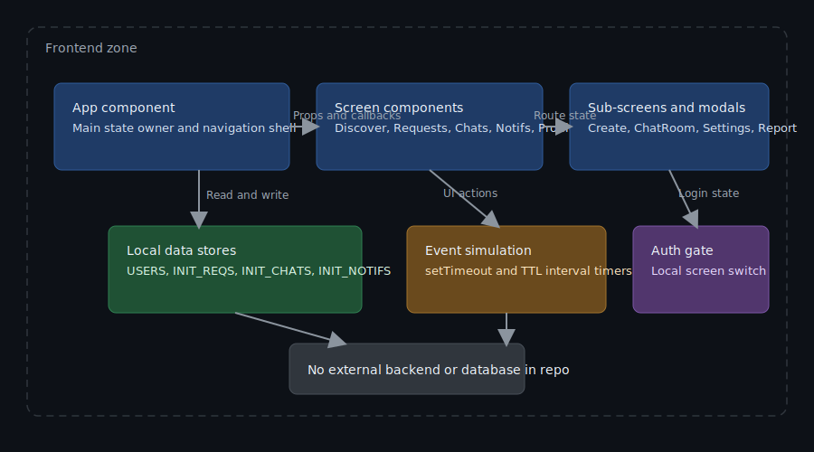
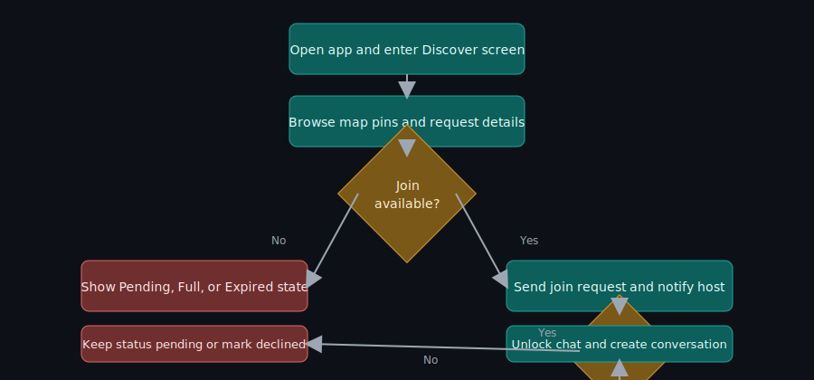

<p align="center">
  
</p>

<p align="center">
  
  
  
  
  
</p>

Companion is a polished React UI prototype for discovering nearby social activities, sending join requests, and chatting once accepted.

---

## What even is this?
Companion is a single-file React app prototype that simulates a local social activity platform. You can browse map pins, filter activity types, post your own request, send join requests, and open chats. It includes realistic interaction details like countdown timers, notifications, profile/settings views, and report/block flows. Everything runs from in-memory data, so it is great for UI prototyping, demos, and product exploration.

## Why does this exist?
A lot of social discovery ideas die in slide decks because there is no believable interactive prototype. This project goes the opposite direction: it prioritizes flow realism and product feel before backend complexity. Instead of wiring APIs too early, Companion models core user journeys with local state and simulated events. It is the kind of prototype you can put in front of people and get useful feedback from quickly.

## Features
- **Map-first discovery** - Browse nearby activity requests with interactive pins and category filters.
- **Join request lifecycle** - Send a request, see pending state, and simulate host acceptance.
- **Real-time-ish chat experience** - Open conversations, send messages, and show typing feedback.
- **Request creation flow** - Post activities with type, radius, expiry, and participant limit controls.
- **Notification center** - Track joins, accepts, and messages with read/unread behavior.
- **Profile and safety tooling** - Edit profile fields, report users, and block/unblock accounts.
- **Settings sub-screens** - Toggle notification, privacy, and location preferences in dedicated views.
- **Dense visual system** - Consistent tokens, reusable UI helpers, and animated mobile-style interactions.

## Architecture
Companion currently ships as a client-only React component exported from a single JSX file. The main App component owns global state and conditionally renders tab screens, sub-screens, and modals. Data is seeded from in-file constants and mutated through local callbacks and hooks. There is no backend, database, or external API integration in this repository yet.

<p align="center">
  
</p>

## How it works
The primary user flow starts in Discover, where users inspect requests on a simulated map. If a request is joinable, the app opens a confirmation modal and records a pending state. A timer-based simulation can accept the request and automatically unlock a chat thread. Notifications and chat unread counts update through local state, and all transitions happen without network calls.

<p align="center">
  
</p>

## Tech stack
| Technology | Role | Why we picked it |
|---|---|---|
| React (hooks) | UI composition and state transitions | The app is interaction-heavy and benefits from local component state plus hook-based effects. |
| JavaScript (JSX) | Application logic and rendering | Fast iteration for prototype flows without adding compile-time constraints yet. |
| CSS-in-JS string injection | Styling and animation system | Keeps visual tokens and component styles colocated in one portable prototype file. |
| In-memory mock data | Demo data source | Enables realistic user journeys without requiring backend setup. |

## Getting started

### Prerequisites
- A React runtime environment that supports JSX.
- A bundler/dev server setup where you can mount this component.
- Optional: Node.js and npm if your host project uses them.

### Installation
```bash
# No package manifest was found in this repository.
# This project currently provides a standalone JSX component file.
```

### Configuration
No environment variable files were found in this repository during the scan.

| Variable | Required | Default | Description |
|---|---|---|---|

### Running locally
```bash
# In your existing React app, place this file in your source tree.
# Example filename in this repository:
# companion-v2-complete.jsx
```

## Usage
Here are concrete ways to use what is currently exported by this repo.

### 1. Render the main app component
```jsx
import React from "react";
import { createRoot } from "react-dom/client";
import App from "./companion-v2-complete.jsx";

createRoot(document.getElementById("root")).render(<App />);
```

### 2. Use as a feature prototype route
```jsx
import { BrowserRouter, Routes, Route } from "react-router-dom";
import App from "./companion-v2-complete.jsx";

export default function Router() {
  return (
    <BrowserRouter>
      <Routes>
        <Route path="/prototype/companion" element={<App />} />
      </Routes>
    </BrowserRouter>
  );
}
```

### 3. Run focused UX testing sessions
```jsx
import App from "./companion-v2-complete.jsx";

export default function PrototypePlayground() {
  // Mount Companion directly so testers can walk through:
  // auth -> discover -> join -> chat -> settings
  return <App />;
}
```

## Use cases
- Teams validating social activity matching flows before building backend APIs.
- Designers and PMs running clickable usability tests with realistic state transitions.
- Engineers prototyping map-based request UX and edge states like pending/expired/full.
- Startups demoing interaction quality to early users or stakeholders.
- Educators teaching React hook patterns in a feature-rich but self-contained example.

## Project structure
```text
Companion/
├── companion-v2-complete.jsx   # Single-file React prototype containing UI, state, and flows
├── docs/                        # Documentation assets
│   └── assets/                  # Generated SVG visuals for README
│       ├── banner.svg           # Project banner graphic
│       ├── architecture.svg     # Component topology diagram
│       └── flow.svg             # Primary request lifecycle diagram
└── README.md                    # Project documentation
```

## API reference
There are no HTTP routes, CLI commands, or packaged library modules exported in the repository.

### React export
#### App
Signature:

```jsx
function App(): JSX.Element
```

Parameters:

| Parameter | Type | Required | Description |
|---|---|---|---|

Returns:
- A full-screen React UI implementing authentication, discovery, requests, chat, notifications, profile, settings, and safety flows.

Example:

```jsx
import App from "./companion-v2-complete.jsx";

export default function DemoPage() {
  return <App />;
}
```

## Development

### Running tests
```bash
# No test framework or test scripts were found in this repository.
```

### Contributing
Contributions are welcome, especially if you want to split the single-file prototype into maintainable modules. If you add tooling, please include scripts and documentation so setup is reproducible. If you introduce backend integration, keep the mock-first workflow available for quick demos. No CONTRIBUTING.md file was found yet, so opening a clear issue or PR description is the best place to start.

## Roadmap
- [x] Build a full interactive prototype with auth, map discovery, requests, chat, notifications, and settings in one component.
- [ ] Add project tooling files such as package.json, linting, and test scripts.
- [ ] Extract screens/components/hooks into a structured source layout.
- [ ] Add real backend integration for auth, activities, messaging, and moderation.
- [ ] Add automated tests and CI workflow.

## License
No license file was found in the repository - all rights are effectively reserved until one is added.

---

<p align="center">
  Made with ☕ and mild existential dread · <a href="https://github.com/Kaelith69">Kaelith69</a>
</p>
